<div align="center">



<br>

**手机放 QQ 音乐,Mac 显示歌词。**<br>
桌面悬浮、逐字同步、菜单栏与灵动岛。

<br>

[](LICENSE)
[](#环境要求) [](#环境要求) [](#验证)

</div>

---

Mac 上不运行任何音乐播放器。手机通过局域网把播放状态推过来,Mac 只负责显示。

> **单向同步 —— Mac 只显示,不控制手机。**
>
> 界面上没有播放/暂停/上一首/下一首,拖进度条也不会有反应。这是一条刻意守住的设计约束,
> 不是功能缺失。

## 为什么做这个

手机端的音质和曲库都更好,但学习或工作时不想拿起手机看歌词。现有方案要么让 Mac 自己播歌
(占用音质与曲库都更差的桌面端),要么只能显示纯文本。

这个项目把两者接起来:**手机继续放,Mac 显示同步歌词。**

## 功能

<table>
<tr><td width="50%" valign="top">

**歌词显示**

- 桌面悬浮歌词 —— 逐字染色、可拖动、可锁定、点击穿透
- 菜单栏歌词 —— 滚动显示,悬停展开
- 灵动岛 —— 带刘海的 Mac
- 歌词窗口 —— 完整可滚动列表
- 翻译 · 罗马音 · 简繁转换 · 单双行

</td><td width="50%" valign="top">

**歌词来源**

- 十个源并行查询与打分择优
- 网易云 · QQ 音乐 · 酷狗 · 酷我 · 咪咕
- Deezer · Musixmatch · LRCLIB · AMLL · LyricFind
- 可用性测试 · 手动搜索 · 歌词库管理与备份

</td></tr>
<tr><td valign="top">

**连接与诊断**

- 六位一次性配对码,之后自动重连
- Bonjour 自动发现,手动地址兜底
- 链路仪表盘:发送数 / 失败数 / 延迟 / 最近一次
- 崩溃与事件记录,不用连数据线就能排查

</td><td valign="top">

**外观**

- 配色主题与自定义颜色
- 系统字体全量可选 · 粗细 · 字号
- 背景材质(透明 / 纯色 / 毛玻璃)
- 可选:收听记录同步到 Last.fm / ListenBrainz

</td></tr>
</table>

## 它是怎么工作的

<div align="center">

</div>

三个阶段:

1. **采集** —— Android 端订阅 QQ 音乐的 MediaSession,播放状态一变就立即产生事件,
   另外每秒发一次心跳(所以 Mac 知道你还在)。
2. **传输** —— 事件进一个单线程有序队列,用设备令牌鉴权,通过局域网推给 Mac。
   序号严格递增,乱序会被 Mac 丢弃;重试保持原顺序。
3. **呈现** —— Mac 校验后交给状态机,重算进度锚点(三档纠偏),再由歌词管线解析并分发到四个展示面。


## 下载安装

不用自己编译 —— 到 **[Releases](https://github.com/37chengshan/phone-lyrics-mac/releases/latest)** 直接下:

| 文件 | 给谁 |
| --- | --- |
| `Lyrimuse-v0.2.2-macos.dmg` | **Mac 端**(推荐,dmg 拖进「应用程序」即可) |
| `Lyrimuse-v0.2.2-macos.zip` | Mac 端备选,内容相同(自动更新走的就是它) |
| `PhoneLyricsRelay-debug.apk` | **Android 端** |

Mac 端首次打开若被系统拦下:右键 → 打开,再点一次「打开」。只需一次。签名是 ad-hoc 的,
没有做公证(见 [许可与版权说明](#许可与版权说明))。

Android 端**建议先卸载旧版**再装:

```bash
adb uninstall com.phonlyrics.relay
adb install -r PhoneLyricsRelay-debug.apk
```

> **Intel Mac 暂时没有兼容包。** 打包要求每个嵌入的二进制都带 x86_64,而读取播放状态用的
> [media-control](https://github.com/ungive/media-control) 上游只发布 arm64。上游出了 universal
> 版本就会补上 —— 发布脚本里那个 `--primary-only` 开关就是为这件事留的。

## 环境要求

| | 要求 |
| --- | --- |
| Mac | macOS 14(Sonoma)或更高 · Apple Silicon |
| Android | Android 8.0(API 26)或更高 |
| 网络 | 两台设备在**同一个局域网** |
| 播放源 | Android 上的 **QQ 音乐** |

## 快速开始

### 1 — 构建 Mac 端

```bash
git clone https://github.com/37chengshan/phone-lyrics-mac.git
cd phone-lyrics-mac
bash apps/macos/lyrimuse/build.sh --no-restart
```

构建完成后装到 `/Applications/Lyrimuse.app`,菜单栏出现图标(**不占 Dock**)。

只想在临时目录试跑、不碰 `/Applications` 的话:

```bash
bash apps/macos/lyrimuse/build.sh --dest /tmp/Lyrimuse.app
open /tmp/Lyrimuse.app
```

### 2 — 构建 Android 端

```bash
cd apps/android/PhoneLyricsRelay
gradle assembleDebug
adb install -r app/build/outputs/apk/debug/app-debug.apk
```

### 3 — 授予两项权限

打开「歌词中继」→「权限」页,两项都要点亮(那里实时显示状态,红了就是没开):

| 权限 | 为什么必须有 |
| --- | --- |
| **通知使用权** | 没有它读不到 QQ 音乐在放什么 |
| **电池优化** | 不关的话后台跑一会儿会被系统杀掉 |

### 4 — 配对(一次性)

1. Mac:菜单栏图标 → 设置 →「手机连接」→「生成配对码」,得到 6 位数字(5 分钟内有效)
2. Android:「连接」页 → 先点「测试连接」确认地址可达
3. 填入那 6 位码 →「配对并保存」

配对成功后设备令牌存进两端的安全存储,以后同一局域网自动重连。

> **配对卡显示「已配对 · <地址> · <多久之前>」是正常的** —— 令牌在配对成功那一刻就持久化了,
> 覆盖安装不会清。想换 Mac 或配错了,同页有「解除配对」。

### 5 — 开始

Android 点「开始同步」,然后用 QQ 音乐放歌。

「状态」页会出现链路仪表盘:

| 指标 | 含义 |
| --- | --- |
| 已发送 | 成功送达的事件条数 |
| 失败 | 重试后仍未送达的条数(正常是 0) |
| 延迟 | 上一次成功发送的往返毫秒数 |
| 最近 | 距上一次成功发送多久(超 15 秒标红) |

失败时按原因给不同的指引:**连不上** → 检查 Wi-Fi 与 Mac 是否在运行;**令牌失效** →
回 Mac 重新配对(这时候查网络没用)。

> **自动发现不可用时**:Mac 设置页的「手动连接备用地址」列出本机局域网地址,填进 Android
> 的手动入口即可 —— 端口默认 `8765`。

<details>
<summary><b>常见问题</b></summary>

**Mac 一直显示「等待手机」**
Android 的「测试连接」先确认地址通不通。通的话检查通知使用权是否真的生效(有时要重启一次 App)。

**在同步,但曲目一直是破折号**
通知使用权没生效 —— 去权限页确认,或重启一次 App。

**歌词对不上 / 找不到歌词**
冷门曲目可能没有源收录。到「歌词」页手动搜索或编辑,结果会进本地缓存。

**手机锁屏后断了**
检查电池优化是否真的关了(部分厂商 ROM 还有自己的后台限制)。

</details>

## 命令

```bash
bash scripts/verify.sh                                   # 全部自动化闸门(约 15 秒)

cd apps/macos/lyrimuse && swift run lyrimuse-selftest    # Swift 自检
cd apps/macos/lyrimuse && swift build                    # Swift 构建
cd apps/macos/lyrimuse-collector && go test ./...        # 歌词采集器
cd apps/android/PhoneLyricsRelay && gradle testDebugUnitTest
```

## 目录

```text
apps/macos/lyrimuse/            Swift 应用(源自 Lyrimuse)
apps/macos/lyrimuse-collector/  Go 歌词解析与缓存
apps/android/PhoneLyricsRelay/  Android 伴侣应用
packages/protocol/              协议 schema 与两端共用的测试夹具
docs/images/                    README 用的动画素材(SVG)
docs/upstream/                  上游基线与同步步骤
docs/verification/              验收证据(含未执行项)
legacy/electron/                早期 Electron 原型(不参与发行)
```

<details>
<summary><b>播放协议</b></summary>

`packages/protocol/schema/playback-envelope-v1.schema.json` 是线上格式的唯一真源,
Swift 与 Kotlin 两侧共用 `packages/protocol/fixtures/` 里的**同一批**夹具。

```json
{
  "protocolVersion": 1,
  "sessionId": "relay-start-uuid",
  "sequence": 1842,
  "event": "heartbeat",
  "track": { "trackId": "…", "title": "晴天", "artist": "周杰伦",
             "album": "叶惠美", "durationMs": 269000 },
  "playback": { "state": "playing", "positionMs": 35214,
                "speed": 1.0, "capturedAtMonotonicMs": 91827364 },
  "source": { "packageName": "com.tencent.qqmusic", "deviceId": "…" }
}
```

- `sessionId + sequence` 决定全序;中继重启换 `sessionId`
- 事件:`trackChanged` / `play` / `pause` / `seek` / `stop` / `heartbeat`
- 状态:`playing` / `paused` / `stopped`
- 播放请求带 `Authorization: Bearer <token>`
- 令牌、请求头与配对码**不写入任何日志**

</details>

## 验证

`bash scripts/verify.sh` 顺序执行协议夹具校验、Swift 自检与构建、Go 测试、Android 单元测试与
调试包构建。**遇错即停**,并指出是哪个子系统挂了。全部通过约 15 秒。

> **真机验收仍需人工执行** —— 需要一台连着同一局域网的 Android 手机与一次人眼观察,
> 自动化脚本无法替代。已执行的运行时证据与尚未执行的项目都记在
> [验收报告](docs/verification/2026-09-17-native-phone-lyrics.md)里。

## 已知限制

- 仅支持 **Android 上的 QQ 音乐**,不回退到其他 App、也不支持 iOS
- Mac **不会**控制手机播放 —— 这是设计如此,不是缺失
- 依赖局域网,不支持跨网络或云中继
- 歌词依赖公开接口,冷门曲目可能找不到;可用「歌词管理」手动搜索或编辑
- Intel Mac 暂无兼容包(上游 media-control 只发 arm64,见[下载安装](#下载安装))
- 手机后台被系统回收时需要手动重开(已内置保活措施,但厂商 ROM 策略各异)

## 相关文档

- [上游基线与同步步骤](docs/upstream/lyrimuse.md)
- [验收报告](docs/verification/2026-09-17-native-phone-lyrics.md)
- [架构设计](docs/superpowers/specs/2026-09-17-phone-lyrics-native-architecture-design.md)

## 致谢

Mac 端基于 [Lyrimuse](https://github.com/Yudaotor/lyrimuse) 修改,保留了它的歌词解析、评分、
字体与外观等绝大部分实现。上游是一个出色的纯本机桌面歌词应用,推荐一试。

## 许可与版权说明

本项目以 **GPL-3.0-or-later** 授权。

它是一个基于 Lyrimuse 的衍生作品,按 GPL-3.0 的要求:

- 保留上游的许可证、版权声明与第三方许可清单
  (见 [`apps/macos/THIRD_PARTY_LICENSES`](apps/macos/THIRD_PARTY_LICENSES))
- 修改内容与完整源码在本仓库公开
- 分发的二进制对应本仓库源码

上游项目:Lyrimuse — https://github.com/Yudaotor/lyrimuse(基线提交 `e6bdf6a`)。
本项目所做的改动见 [NOTICE](NOTICE)。

## License and Copyright

This project is licensed under **GPL-3.0-or-later**.

It is a modified version of Lyrimuse. Per GPL-3.0, the upstream license, copyright notices and
third-party license list are retained (see [`apps/macos/THIRD_PARTY_LICENSES`](apps/macos/THIRD_PARTY_LICENSES)),
the changes are documented in [NOTICE](NOTICE), and the complete corresponding source is published
in this repository.

Upstream: Lyrimuse — https://github.com/Yudaotor/lyrimuse (baseline commit `e6bdf6a`).
